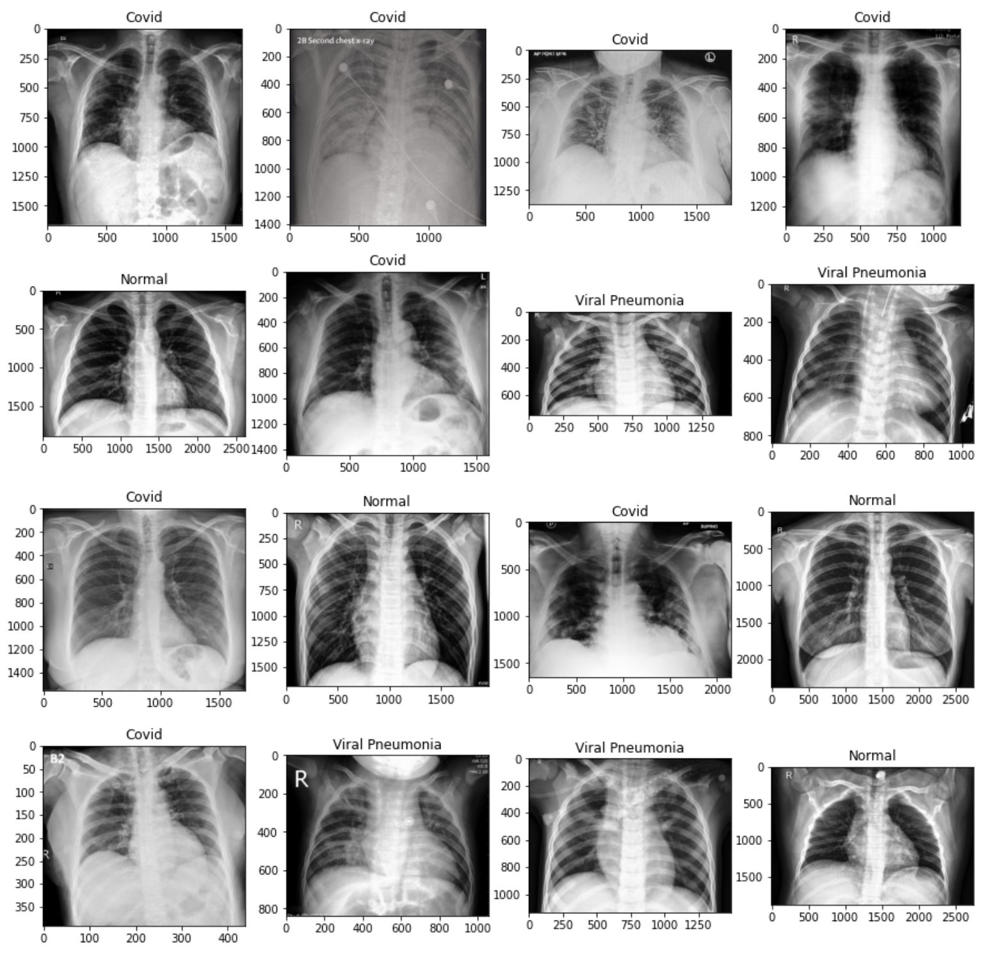

# COVID-19 Detection

## Overview

This project focuses on the detection of COVID-19 using a pre-trained VGG16 model. The dataset used is the COVID-19 Image Dataset, containing images categorized into three classes: COVID, Normal, and Viral Pneumonia. The model is trained to classify chest X-ray images, providing insights into COVID-19 diagnosis.

## Dataset


The COVID-19 Image Dataset is downloaded from Kaggle, comprising images of chest X-rays for COVID-19, Normal, and Viral Pneumonia cases. The dataset is preprocessed to create a training and testing set for model evaluation.

## Model Architecture

The VGG16 model, pre-trained on the ImageNet dataset, is used as a feature extractor. The last few layers are modified to include a Global Average Pooling layer, dense layers, and a softmax activation for classification into three classes. The model is compiled using the Adam optimizer and categorical crossentropy loss function.

## Data Preprocessing

Images are loaded and preprocessed using the Keras ImageDataGenerator. Augmentations such as rescaling, rotation, and zoom are applied to the training set to enhance model generalization.

## Training

The model is trained for 40 epochs on the training set, and the training history is visualized using accuracy and loss plots.

```
history = model.fit(train_generator,
                    validation_data=test_generator,
                    epochs=40)
```

## Model Evaluation

The trained model is evaluated on the test set, and accuracy and loss metrics are analyzed to assess performance.
Results

The project concludes with insights into the training and validation process, including accuracy and loss trends. The trained model is saved for future use.

Feel free to explore the Jupyter Notebook for a comprehensive understanding of the COVID-19 detection process using chest X-ray images.